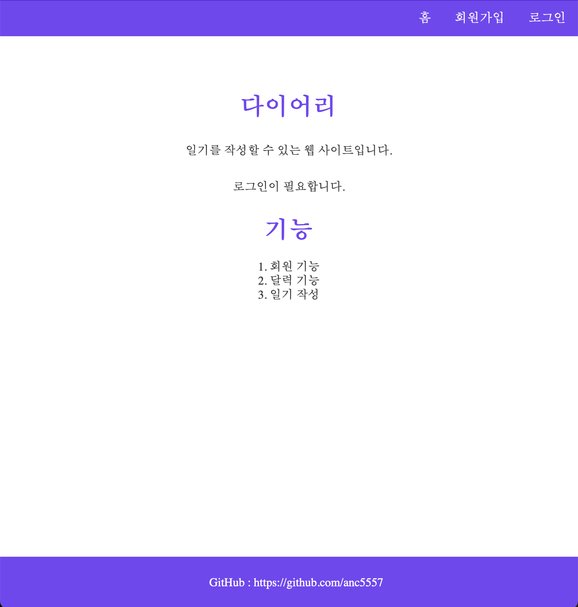
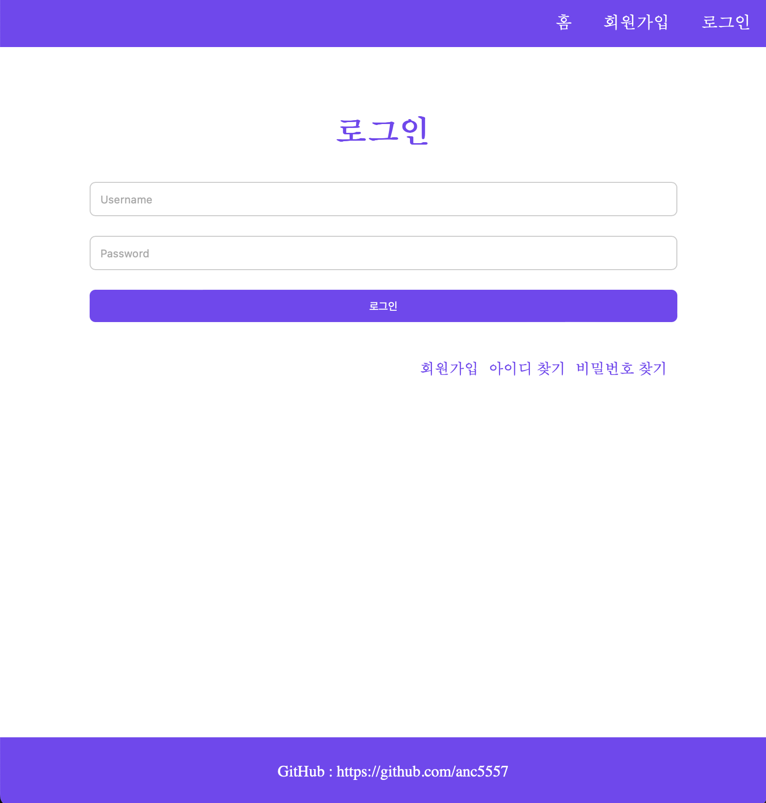
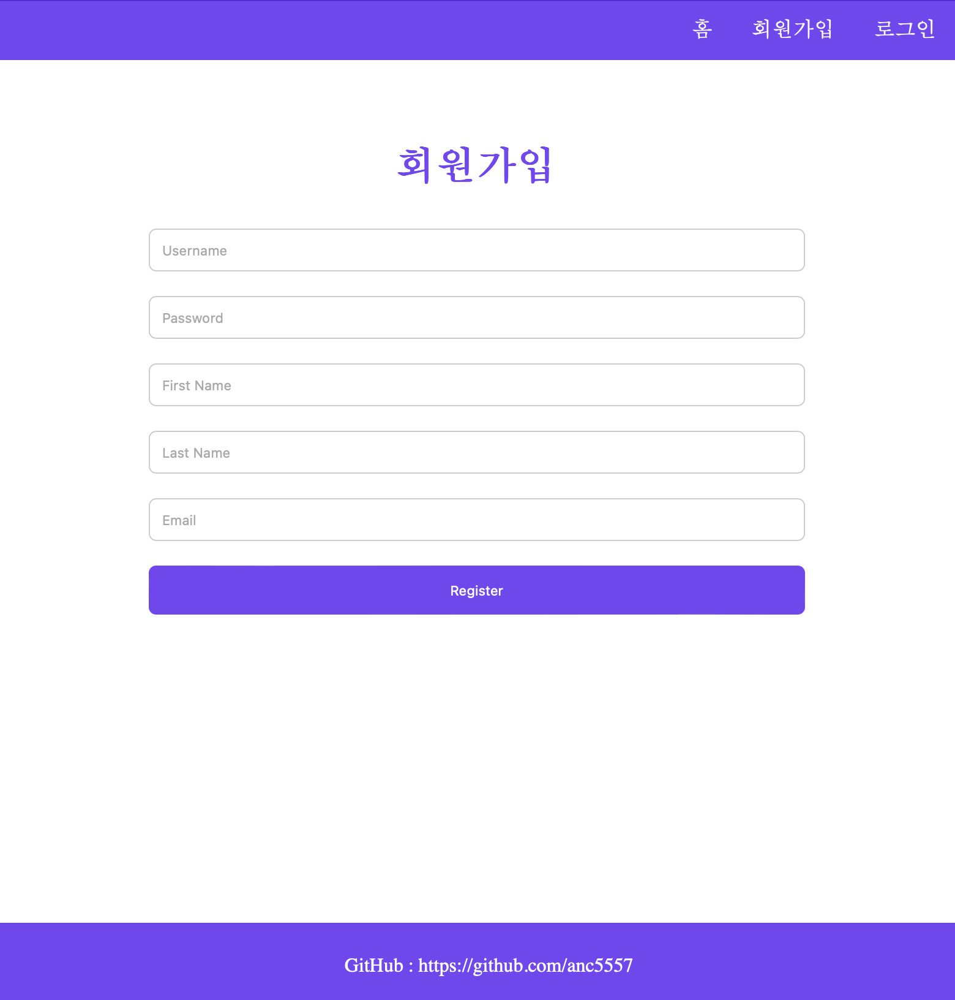
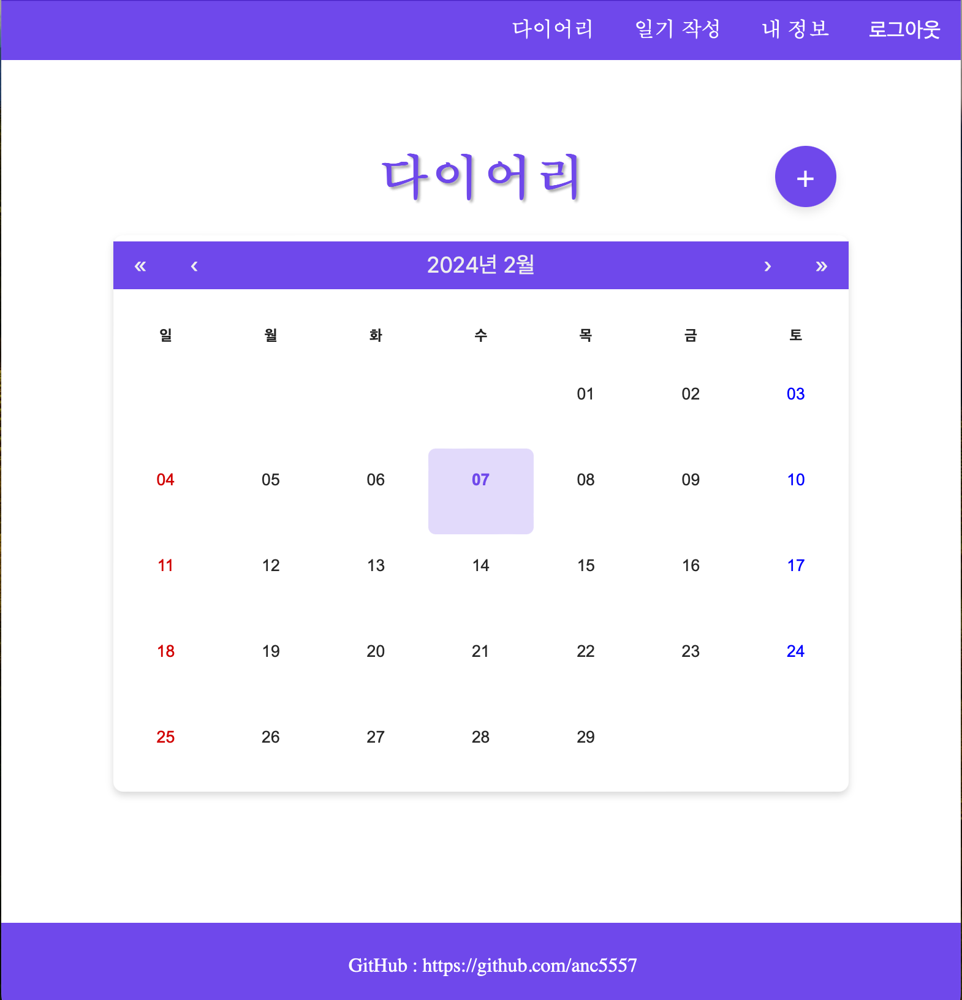
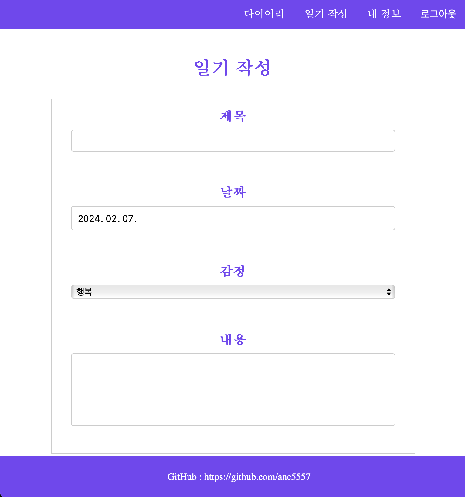
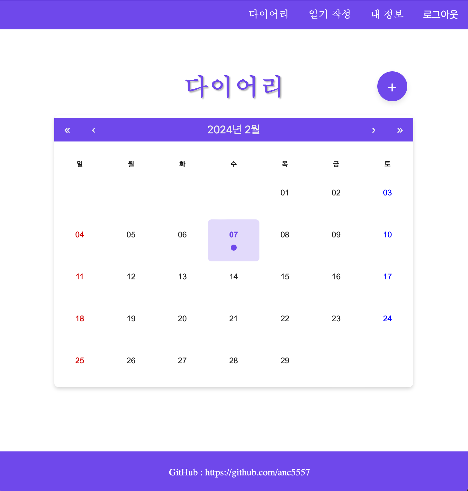

# Diary

Javascript, React18, Node.js, Express 연습용 프로젝트

# 기간

2023.10.31 ~ 진행 중

# 기술 스택

- 프론트엔드: HTML, CSS, Javascript, React18
- 백엔드: Node.js, Express, MongoDB

# 기능

1. 회원 기능

   1. 회원가입(username, password, firstName, lastName, email)
   2. 로그인(JWT Token)
   3. 회원정보 변경(password, firstName, lastName, email)
2. 달력 기능

   1. 일기가 있을 경우 해당 날짜에 표시
   2. 켈린더 날짜를 클릭하면 일기 작성 가능
3. 일기 기능

   1. 글 쓰기 기능(제목, 날짜, 감정, 내용)
   2. 타임 스탬프 기능

# 화면

